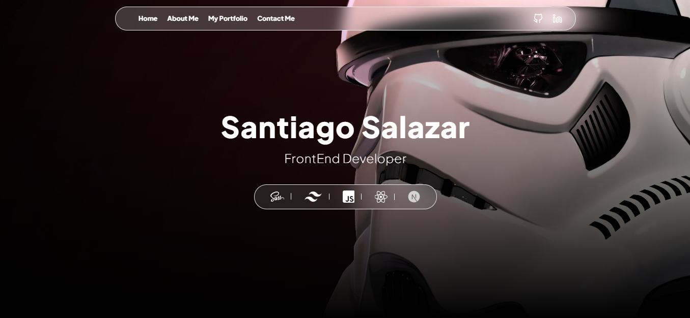
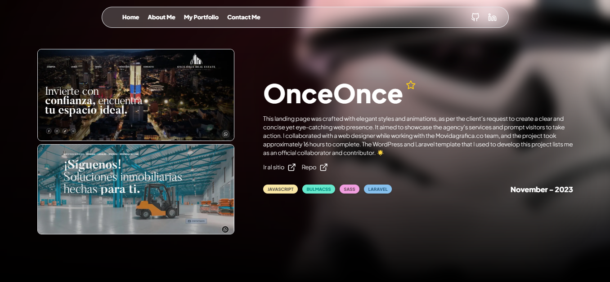

# My Portfolio Web ✨

This is my web portfolio, where you can see my projects and my skills in them and get to know me a little better

## Description 👀

This project has two objectives:

1. Introduce myself and my most outstanding projects.
2. Serve as a template as a portfolio for any developer who sees fit

Little by little I will improve it as a template to make it more dynamic. I will always be open to advice and recommendations from the community.

## Screenshot 💻





## Run Locally 🚀

Clone the project

```bash
  git clone https://github.com/SantiagoCode/Portfolio.git
```

Go to the project directory

```bash
  cd Portfolio
```

...

## Author

- [@SantiagoCode](https://www.github.com/SantiagoCode) 😉
